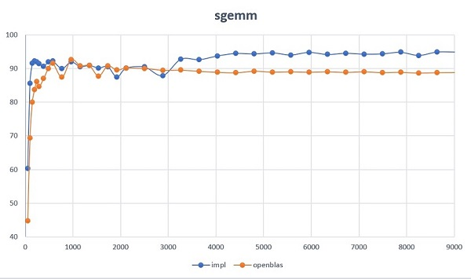

# gemm_opt

*currently only consider signle cpu core.*

optimize gemm on x86 arch, tested on **Intel(R) Xeon(R) Gold 6142** CPU
* L1d cache:             32K
* L1i cache:             32K
* L2 cache:              1024K
* L3 cache:              22528K
* L1d TLB :              64 entries

most of the size exceed [openblas](https://github.com/xianyi/OpenBLAS)(0.3.4)



detail is in [this PDF](res/cpu_gemm.pdf) for how to design the blocking/kernel.

```
# 6x16 micro kernel
# need disable intel HT(hyperthread) in BIOS. also, frequency boost is prefered to close.
# ./gemm_driver  -kc 360 -nc 672 -mc 3072

cpu:2, freq: 2600.0MHz, theoritical: 81.250 gflops (avx256,fmadd)
l1_size:32K, l2_size:1M, l3_size:22M, page_size:4096, tlb_entry_l1d:64
MC:3072, NC:672, KC:360, MR:6, NR:16
layout:CblasRowMajor, trans_a:CblasNoTrans, trans_b:CblasNoTrans
Considerations:
 L1: MR*KC+NR*KC+MR*NR+NR+MR*NR < L1_size/d_size, lhs:8128, rhs:8192, match?yes
 L2: NC*KC+MR*KC+MR*NC+MR*KC+MR*NC < L2_size/d_size, lhs:254304, rhs:262144, match?yes
 L3: MC*KC+NC*KC+MC*NC+NC*KC+MC*NC < L3_size/d_size, lhs:5718528, rhs:5767168, match?yes
 L1D TLB:
  TA:CEIL(MR*KC*d_size/PAGE_SIZE)+1, 4
  TB:CEIL(NR*KC*d_size/PAGE_SIZE)+1, 7
  TC:up to MR, 6
  TA+2*(TB)+TC < T_entry_total, lhs:24, rhs:64, match?yes

    M    N    K alpha beta   gflops(%)   gflops_ref(%)
   48   48   48  1.0  1.0  49.07(60.3932)  36.42(44.8303)
   96   96   96  1.0  1.0  69.56(85.6174)  56.38(69.3951)
  144  144  144  1.0  1.0  74.42(91.5984)  65.01(80.0070)
  192  192  192  1.0  1.0  74.93(92.2233)  68.02(83.7199)
  240  240  240  1.0  1.0  74.78(92.0309)  70.04(86.1970)
  288  288  288  1.0  1.0  74.32(91.4647)  68.78(84.6567)
  384  384  384  1.0  1.0  73.67(90.6766)  70.76(87.0887)
  480  480  480  1.0  1.0  74.78(92.0350)  73.19(90.0815)
  576  576  576  1.0  1.0  74.97(92.2685)  74.43(91.6048)
  768  768  768  1.0  1.0  73.17(90.0541)  71.08(87.4829)
  960  960  960  1.0  1.0  74.77(92.0234)  75.32(92.7058)
 1152 1152 1152  1.0  1.0  73.62(90.6131)  73.85(90.8878)
 1344 1344 1344  1.0  1.0  73.91(90.9661)  73.85(90.8930)
 1536 1536 1536  1.0  1.0  73.28(90.1962)  71.36(87.8252)
 1728 1728 1728  1.0  1.0  73.62(90.6039)  73.80(90.8357)
 1920 1920 1920  1.0  1.0  71.11(87.5194)  72.78(89.5735)
 2112 2112 2112  1.0  1.0  73.21(90.1096)  73.27(90.1845)
 2496 2496 2496  1.0  1.0  73.55(90.5194)  73.19(90.0760)
 2880 2880 2880  1.0  1.0  71.46(87.9467)  72.76(89.5563)
 3264 3264 3264  1.0  1.0  75.42(92.8297)  72.80(89.5952)
 3648 3648 3648  1.0  1.0  75.29(92.6696)  72.48(89.2091)
 4032 4032 4032  1.0  1.0  76.21(93.7987)  72.26(88.9392)
 4416 4416 4416  1.0  1.0  76.80(94.5237)  72.15(88.7987)
 4800 4800 4800  1.0  1.0  76.68(94.3777)  72.51(89.2466)
 5184 5184 5184  1.0  1.0  76.95(94.7070)  72.31(88.9960)
 5568 5568 5568  1.0  1.0  76.44(94.0799)  72.38(89.0835)
 5952 5952 5952  1.0  1.0  77.07(94.8585)  72.28(88.9585)
 6336 6336 6336  1.0  1.0  76.56(94.2221)  72.38(89.0813)
 6720 6720 6720  1.0  1.0  76.84(94.5734)  72.25(88.9213)
 7104 7104 7104  1.0  1.0  76.63(94.3164)  72.38(89.0825)
 7488 7488 7488  1.0  1.0  76.69(94.3917)  72.19(88.8501)
 7872 7872 7872  1.0  1.0  77.09(94.8838)  72.26(88.9343)
 8256 8256 8256  1.0  1.0  76.33(93.9498)  72.07(88.7069)
 8640 8640 8640  1.0  1.0  77.15(94.9568)  72.18(88.8339)
 9024 9024 9024  1.0  1.0  77.14(94.9433)  72.22(88.8865)

```